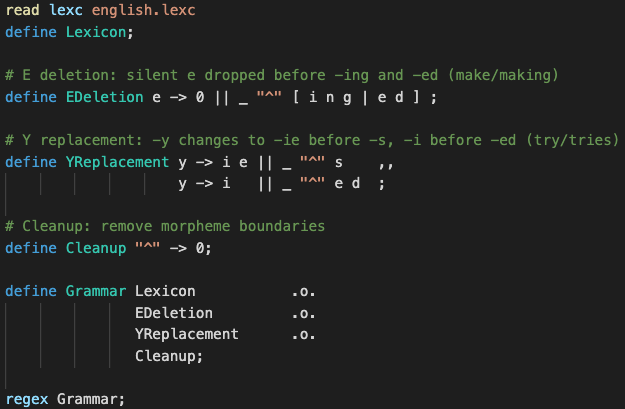

# xfscript README

Provides syntax highlighting for `xfscript` files — script files for `xfst`, HFST, Foma, and friends.

## Features

## Release Notes

Better comment matching (thanks [taiqihe](https://github.com/taiqihe)!)

### 0.0.2

### 0.0.2

Add `.fomascript` extension.

Use `#` comments.

### 0.0.1

Initial release of `xfscript`

## License

Copyright © 2019, 2020 National Research Council Canada.

Licensed under the MIT license.
